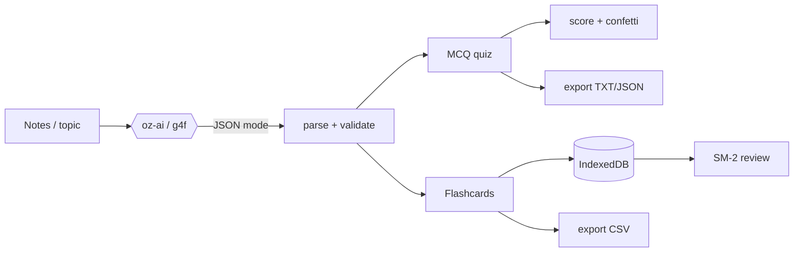

# oriz-quiz

- **Live app:** https://quiz.oriz.in
- **About / info:** https://chirag127.github.io/oriz-quiz/
- **For LLMs:** https://quiz.oriz.in/llms.txt · https://quiz.oriz.in/llms-full.txt

AI quiz + flashcard maker. Paste notes or a topic, get a multiple-choice quiz or spaced-repetition flashcards, take the quiz, score, and export.

> **100% client-side. No upload, no signup, free.** Your notes never leave the browser. AI runs keyless via g4f with multi-provider failover.

[](./LICENSE)


## What it does

- **MCQ quiz** - paste material, AI writes 3-30 questions with 4 options + one-line explanations. Take it; answer-lock reveals the right answer and explains wrong picks.
- **Flashcards** - AI turns notes into front/back cards, stored locally, reviewed with the **SM-2** spaced-repetition algorithm (Again / Hard / Good / Easy).
- **Score + streak** - a running streak fires confetti at 3+; a perfect quiz throws a big burst.
- **Save decks** - flashcard decks persist in IndexedDB; reopen and only the *due* cards come up.
- **Export** - quiz to TXT / JSON, deck to CSV (Anki/Quizlet friendly).
- **Pick a model** - auto-failover by default, or choose any g4f model.

Empty input? It uses a built-in sample topic so you can try it in one click.

AI is **optional polish** - if every provider is down, generation shows a clear error and the rest of the tool (taking a saved quiz, reviewing saved decks, exporting) still works.

## How it works



## Two surfaces

This repo powers two things:

- The **live app** on Cloudflare Pages: https://quiz.oriz.in
- A separate **info page** on GitHub Pages (about the project, not a mirror): https://chirag127.github.io/oriz-quiz/ (source in `gh-info/`, published by `.github/workflows/gh-pages-info.yml`).

## Tech

- Client-only **Astro** static site; React island for the app UI.
- Keyless AI via `@chirag127/oz-ai` (g4f / gpt4free, multi-provider failover).
- IndexedDB for decks; **SM-2** spaced repetition; no server, no database.
- **PWA-installable**, offline-capable; shared `@chirag127/oz-*` fleet packages, themed per site (chalkboard palette here).

## Develop

```bash
npm install --legacy-peer-deps
npm run dev        # local
npm test           # vitest - SM-2, parsing, export
npm run build      # static output to dist/
npm run deploy     # build + wrangler pages deploy
```

Windows note: use **npm**, not pnpm (pnpm skips `@esbuild/win32-x64` and the Astro build crashes).

## License

MIT (c) 2026 Chirag Singhal
